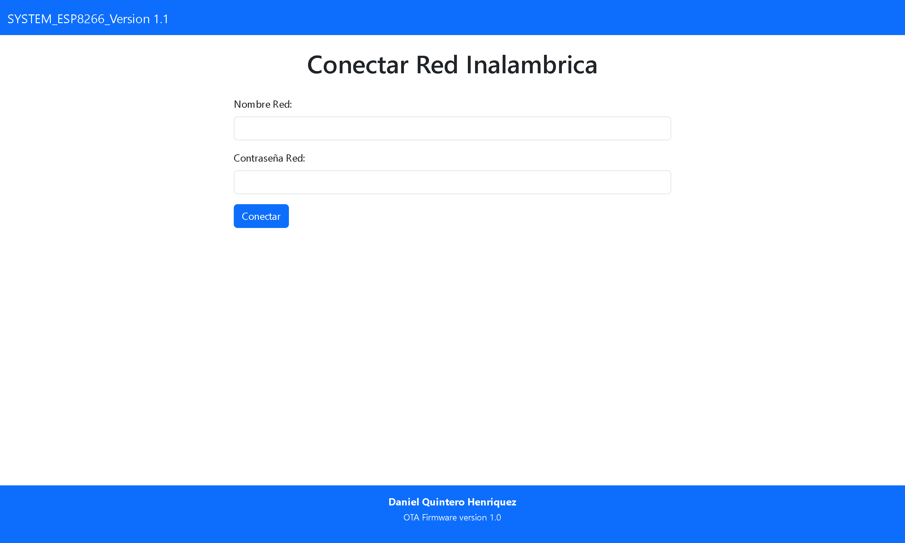
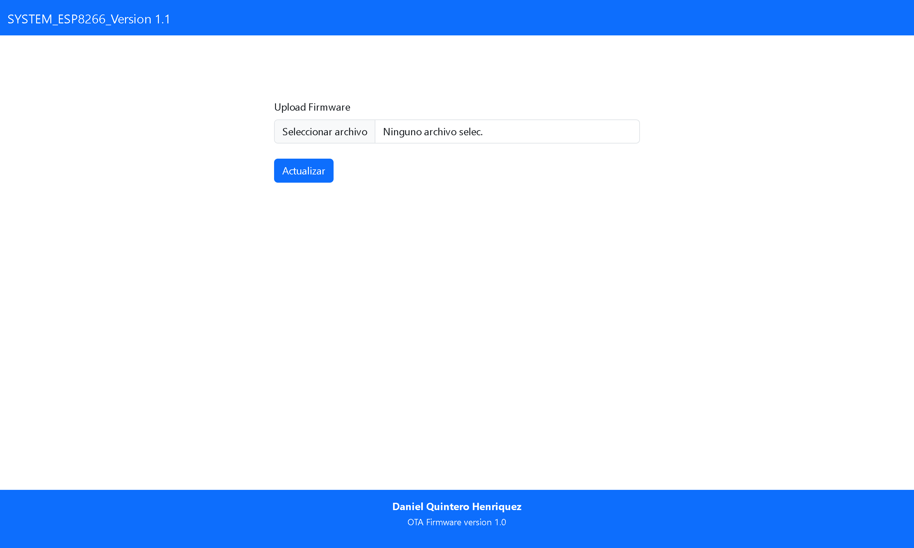

<center>  
 
 # DQAsyncServer 
</center>

## _Biblioteca para actualización OTA en dispositivos ESP8266 🚀_
<center>


</center>

## Introducción

Esta biblioteca permite realizar actualizaciones OTA para dispositivos ESP8266. la he hecho basandome en la biblioteca ElegantOTA, evidentemente mucho menos sofisticada y mas simple el proposito es agregar funciones que se adapten a algunos proyectos específicos que estoy realizando💡.

## Tecnologías utilizadas

La biblioteca AsyncServer se utiliza para crear un servidor HTTP con una interfaz para cargar las actualizaciones en el dispositivo 🌐.
La interfaz de actualización del dispositivo está hecha en HTML, CSS y JavaScript. En concreto, se utiliza Bootstrap para el desarrollo de las vistas 👔.

Los archivos de las vistas que se utilizaron para el desarrollo de la biblioteca se encuentran en la carpeta ui 📁, tambien agregue algunas funciones que me son de utilidad.

al encender el dispostivo si se sigue el codigo del ejemplo, este creara un punto de conexion 🌐AP una vez conectado alli se podra acceder a la interfaz principal donde se podra conectar a la red inalambrica que quiera pasando la informacion de conexion en la interfaz.



## Objetivos

El objetivo de esta biblioteca es crear una plataforma de código simple para actualizaciones OTA para dispositivos ESP8266 🏢. Se pretende que sea simple y adaptable con algunos proyectos específicos 🛠.



### Ejemplo de Uso: 

```
#include <DQAsyncServer.h>
#include <ESPAsyncWebServer.h>

AsyncWebServer server(80);

void setup(){
      //Create Parameters
      const char* ssid     = "ESP8266-Access-Point";
      const char* password = "123456789";
      int port = 80;
      
      server.on("/say", HTTP_GET, [](AsyncWebServerRequest *request) {
         request->send(200, "text/plain", "Hola! Bienvenido al Proyecto DQAsyncServer.");
      });
      
      DQAsyncServer.launch(&server);
      server.begin();

      WiFi.mode(WIFI_AP);
      WiFi.softAP(ssid, password);

      SPIFFS.begin();
      Serial.printf(" HTTP Server Started on Port: ", port);
}

void loop(){
}
```

###  Sigueme en mis redes Sociales y enterate del contenido que hago: .

<a target="_blank" href="https://www.linkedin.com/in/henry-daniel-quintero-henriquez/"></a>
<a target="_blank" href="https://www.youtube.com/@DanielQuinteroHenriquez"></a> 
<a target="_blank" href="mailto:danielquinterohenriquez@gmail.com"></a>

##  Daniel Quintero 

